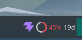
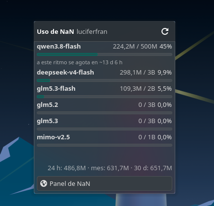
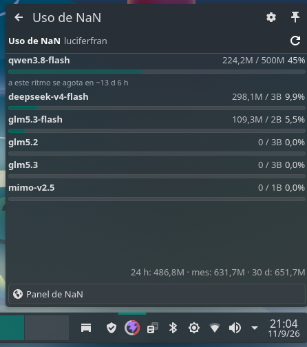

# NaN Usage

A KDE Plasma 6 widget for your [NaN](https://nan.builders) subscription quota,
inspired by
[gnome-nan-usage](https://github.com/prgr1no/gnome-nan-usage).

Shows on the panel the percentage of the model that is closest to its limit, the
days until reset, and on click a popup with a bar per model, the consumption rate
projection, and aggregated usage for the last 24 h, the month, and 30 days.

New to NaN? Use [this referral link](https://cloud.nan.builders/r/BM7BJE4M) to
sign up.

<p align="center">
  <a href="https://github.com/luciferfran/kde-nan-usage/actions/workflows/ci.yml"></a>
  
  
</p>

## Screenshots

<p align="center">
  
</p>
<p align="center"><sub>The indicator on the panel: icon, ring gauge, percentage, and days until reset.</sub></p>

<p align="center">
  
</p>
<p align="center"><sub>The popup: a bar per model, rate projection, aggregated consumption, and the button to the NaN dashboard.</sub></p>

<p align="center">
  
</p>
<p align="center"><sub>The same widget on the desktop, where the full view is shown.</sub></p>

## Features

- **Compact panel view**: icon, ring (or bar) with the percentage of the
  most-constrained model and time until reset.
- **Detailed popup**: one bar per model with tokens used, capacity, remaining,
  and rate projection.
- **Consequence-based alerts, not just percentage**: amber if the average rate
  projects ≥ 75 % by reset; red if at that rate the quota runs out before the
  reset, leaving you blocked for a while.
- **Aggregated consumption** for 24 h, month, and 30 days (optional, one extra
  request).
- **No OAuth**: reads the API key from the same file used by the `nan` CLI.
- **Polite with the API**: if NaN fails and there was data already, it keeps it
  and says so; between polls it recalculates "resets in …" without touching the
  network.
- **Configurable**: key path, poll interval, panel model, gauge style, and what
  parts to show.

## Requirements

- **KDE Plasma 6.0 or later.**
- A NaN subscription with an API key.

## Installation

### One command

```sh
curl -fsSL https://raw.githubusercontent.com/luciferfran/kde-nan-usage/main/scripts/install-online.sh | bash
```

Clones the repo, installs the widget and icon, and tells you how to add your API
key. Then **restart Plasma** or log out and back in for it to appear. Prefer to
read it first? It's at
[`scripts/install-online.sh`](scripts/install-online.sh).

### Development (symbolic link)

```sh
git clone https://github.com/luciferfran/kde-nan-usage.git
cd kde-nan-usage
./install.sh          # links org.nan.usage into ~/.local/share/plasma/plasmoids
```

`./install.sh copy` leaves a clean copy instead of a link;
`./install.sh uninstall` removes it.

### With kpackagetool6

```sh
kpackagetool6 --type Plasma/Applet --install org.nan.usage

# Theme icon (so it shows up in the widget list):
mkdir -p ~/.local/share/icons/hicolor/scalable/apps
cp org.nan.usage/contents/icons/nan.svg ~/.local/share/icons/hicolor/scalable/apps/nan.svg
```

### Without git

Download the code from the
[latest release](https://github.com/luciferfran/kde-nan-usage/releases/latest)
(button "Source code"), extract it, and inside the folder run `./install.sh`.

Then **restart Plasma** or log out and back in for the widget to appear. On
Wayland, Plasma does not hot-reload QML.

Then add the widget from **Right-click on the panel → Add widgets → NaN Usage**,
from the system tray (**Configure Tray → Entries**), or from the desktop
(**Right-click on desktop → Add widgets**). On the panel and tray you see the
compact view; on the desktop the full view is shown.

## The API key

The widget reads the key from `~/.config/nan/api-key` (single line). This is the
same file used by the `nan` CLI and other community tools. To create it with the
correct permissions:

```sh
mkdir -p ~/.config/nan
(umask 177; printf %s 'YOUR_API_KEY' > ~/.config/nan/api-key)   # mode 600
```

The path can be changed in settings. The key **never** appears in logs or error
messages.

## Settings

From ⚙ in the popup or in the widget configuration:

| key | what it does | default |
| --- | --- | --- |
| `keyPath` | file with the API key (`~` is accepted) | `~/.config/nan/api-key` |
| `pollSeconds` | seconds between polls (60 to 1800) | `300` |
| `panelModel` | which model the panel reflects: `worst` (level then usage), `max` (highest usage), `fixed` | `worst` |
| `panelModelId` | model id used when `panelModel` is `fixed` | `deepseek-v4-flash` |
| `panelGauge` | `ring`, `bar`, or `none` | `ring` |
| `showIcon` | show the icon | yes |
| `showPercentage` | show the utilization percentage | yes |
| `showReset` | show time until reset | yes |
| `hideUnused` | hide zero-usage models in the popup | yes |
| `showMetrics` | 24 h / month / 30 d consumption line (one extra request) | yes |

## How it works

NaN's inference API (`api.nan.builders/v1`, LiteLLM) doesn't expose usage. The
web dashboard backend, `cloud-api.nan.builders`, does, with the same key as a
`Bearer` token. These routes come from the web bundle and **have no public
contract**: they may change without notice.

| route | use here |
| --- | --- |
| `GET /api/usage/quota` | `periodStart` and `models[]` with `tokensUsed`, `cap`, `remaining`, `periodEnd`; feeds the bars |
| `GET /api/auth/me` | handle, region, and tier from the header; requested once |
| `GET /api/metrics/usage` | aggregated consumption 24 h / month / 30 d, optional |

- **Consequence-based level.** Amber if the period's average rate projects ≥ 75 %
  by reset; red if at that rate the quota runs out and the blockage would last at
  least 10 % of the period. During the first days (less than 5 % elapsed) no
  extrapolation happens: the average is noise.
- **The key is read from the file on every poll** (it's tiny), so changing it
  does not require restarting Plasma.
- **Polls every 5 minutes** by default, another on popup open and with "↻
  Refresh", with a 30 s minimum between requests.

## Development and testing

```sh
node org.nan.usage/tests/quotaModel.test.js   # pure logic with synthetic data and fixed clock
/usr/lib/qt6/bin/qmllint -I /usr/lib/qt6/qml org.nan.usage/contents/ui/*.qml
```

The gauge, popup, and settings are only visible inside Plasma. To iterate without
logging out, restart the shell:

```sh
kquitapp6 plasmashell && kstart plasmashell
```

Load errors appear in:

```sh
journalctl --user -b -o cat /usr/bin/plasmashell | grep -i nan-usage
```

## Uninstall

```sh
./install.sh uninstall
# or:
kpackagetool6 --type Plasma/Applet --remove org.nan.usage
```

## Security

- The API key **never** appears in logs or error messages.
- The key file path is validated: no path traversal (`..`), no absolute paths
  outside `$HOME`, no shell injection characters (`` ` ``, `;`, `|`, `&`).
- API responses are validated before processing.
- Network timeout adjusts dynamically to the poll interval (70 %, between 5 and
  15 s).
- `install.sh` warns if the API key file has insecure permissions (must be 600
  or 400).
- All traffic goes directly to NaN; the widget stores no data and sends nothing
  to third parties.

## Privacy

All traffic goes from your machine to NaN, with your key. The widget sends no
data anywhere else, keeps no history, and does not write the key anywhere.

## License

**GPL-2.0-or-later.** This is a port of the
[gnome-nan-usage](https://github.com/prgr1no/gnome-nan-usage) project by prgr1no,
which in turn derives the skeleton (panel button, ring, bars, and projection)
from [Claude Code Usage Monitor](https://github.com/dvdstelt/ClaudeCodeUsage) by
David Boike (GPL-2.0). See [LICENSE](LICENSE).

---

<sub>Community project, <strong>not official</strong>: not affiliated with or
endorsed by nan.builders. "NaN" and its logo belong to their respective owners.</sub>